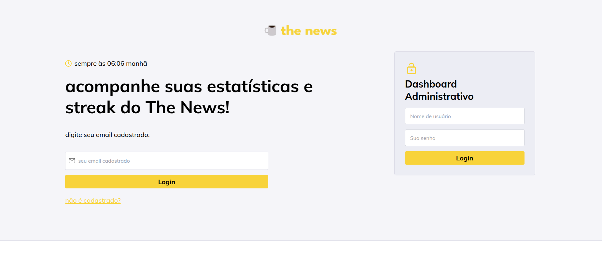

# Waffle Case: Streak the News

🔗 **Acesse o projeto online:** [Waffle Case](https://waffle-case.vercel.app/)

🖼️ **Pré-visualização:**  

## 🔑 Logins de Teste

- **Usuários:**

  - ✉️ `teste@email.com`
  - ✉️ `boo@email.com`

- **Administrador:**
  - ✉️ `admin@admin.com`
  - 🔑 Senha: `admin`

---

## 📌 Descrição

**Waffle Case** é uma aplicação web desenvolvida com **React**, **TypeScript** e **Vite**. A aplicação permite que os usuários acompanhem suas estatísticas e streaks de leitura de posts, além de fornecer um **dashboard administrativo** para visualizar dados agregados.

---

## 🚀 Funcionalidades

### 🔑 Login de Usuário

Os usuários podem fazer login utilizando seu e-mail cadastrado. O login verifica se o usuário existe no banco de dados e, se existir, redireciona para o **dashboard do usuário**.

### 📊 Dashboard do Usuário

- Exibe informações sobre o **streak de leitura**, o último post aberto e os posts acessados na semana atual.
- Mostra informações sobre as **fontes UTM** dos posts.

### 📈 Dashboard Administrativo

- Exibe os **top 3 usuários** com maior streak.
- Mostra os **top 3 posts** mais acessados.
- Informa o **último post aberto** e apresenta dados UTM agregados.

---

## ⚙️ Configuração

### 📌 Pré-requisitos

- **Node.js**
- **npm** ou **yarn**

### 📥 Instalação

1. Clone o repositório:

   git clone https://github.com/seu-usuario/waffle-case.git
   cd waffle-case

2. Instale as dependências:

   npm install
   ou
   yarn install

3. Configure as variáveis de ambiente:
   Crie um arquivo .env.local na raiz do projeto e adicione as seguintes variáveis:
   VITE_SUPABASE_URL=your-supabase-url
   VITE_SUPABASE_ANON_KEY=your-supabase-anon-key

### Executando a Aplicação

Para iniciar a aplicação em modo de desenvolvimento, execute:

    npm run dev
    ou
    yarn dev
